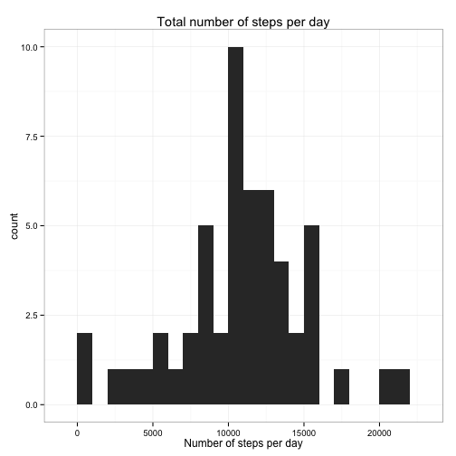
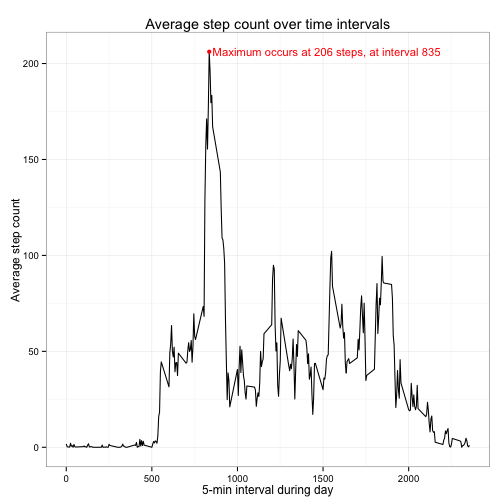
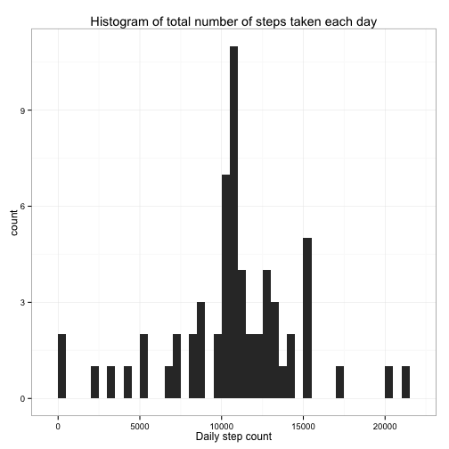
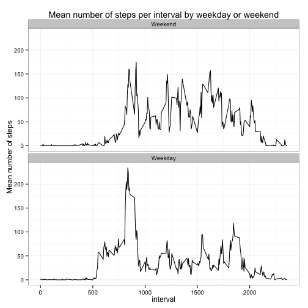

## Loading and preprocessing the data

```r
# load data
steps <- read.csv('./activity.csv', header = T)

# packages
suppressPackageStartupMessages(library('dplyr'))
suppressPackageStartupMessages(library('ggplot2'))
suppressPackageStartupMessages(library('knitr'))
```

## What is mean total number of steps taken per day?

```r
# Number of steps/day
daystepcount <- steps %>% group_by(date) %>% summarise(day.count = sum(steps))
```
The total number of steps were calculated in `daystepcount` and the output of this calculation is shown
in the histogram.


```r
ggplot(daystepcount) + geom_histogram(aes(x = day.count), binwidth = 1000) + 
  theme_bw() + ggtitle('Total number of steps per day') + xlab('Number of steps per day')
```

 


```r
# Mean and median number of steps/day
mstepcount <- daystepcount %>% ungroup() %>% 
  summarise(mean = mean(day.count, na.rm = T), median = median(day.count, na.rm = T))

mstepcount %>% data.frame
```

```
##       mean median
## 1 10766.19  10765
```
The mean total number of steps taken per day were 10766.19 and the median total steps taken per day were
10765. 

## What is the average daily activity pattern?

```r
# Mean step count per inteval (misc)
misc <- steps %>% group_by(interval) %>% 
  summarise(meansteps = mean(steps, na.rm = T))

maxinterval <- misc[which(misc$meansteps == max(misc$meansteps)),]
maxinterval$label <- paste('Maximum occurs at',round(maxinterval$meansteps,0),
                           'steps, at interval',maxinterval$interval)

ggplot(misc, aes(x = interval, y = meansteps)) + geom_line() + 
  geom_point(data = maxinterval, colour = 'red', size = 2) +
  geom_text(data = maxinterval, aes(x = interval + 20, label=label),
            hjust = 0, colour = 'red', size = 4) +
  ylab('Average step count') + xlab('5-min interval during day') + theme_bw() + 
  ggtitle('Average step count over time intervals')
```

 

Maximum occurs at 206 steps, at interval 835

## Imputing missing values
There are 2304 missing values in the dataset.

I will impute using the rounded mean number of steps at each interval.
These values are calculated above in the variable `misc`.

```r
#Add the meansteps at each inteval to steps
steps.imputed <- left_join(steps, misc)
```

```
## Joining by: "interval"
```

```r
# If step is NA change to meansteps
steps.imputed <- steps.imputed %>% mutate(steps = ifelse(is.na(steps),round(meansteps,0),steps))
```
The new dataset is stored in `steps.imputed` 


```r
# Number of steps/day imputed
daystepcount.imp <- steps.imputed %>% group_by(date) %>% 
  summarise(day.count = sum(steps))

# Mean and median number of steps/day imputed
mstepcount.imp <- daystepcount.imp %>% ungroup() %>% 
  summarise(mean = mean(day.count, na.rm = T), median = median(day.count, na.rm = T))

ggplot(daystepcount.imp) + geom_histogram(aes(x = day.count), binwidth = 500) + 
  ggtitle('Histogram of total number of steps taken each day\nAfter imputation') + theme_bw() +
  xlab('Daily step count')
```

 

The mean and median number of steps per day of the imputed data

```r
mstepcount.imp %>% data.frame
```

```
##       mean median
## 1 10765.64  10762
```
To compare with the  mean and median number of steps per day of the original data

```r
mstepcount %>% data.frame
```

```
##       mean median
## 1 10766.19  10765
```
Pretty close! The effect on the mean and median was not that big but we got more data. That is always good :)

## Are there differences in activity patterns between weekdays and weekends?
I will use the original dataset as I did not take weekday into account when imputing

```r
# set the locale to english for english weekdays
Sys.setlocale("LC_TIME",'en_US.UTF-8')
```

```
## [1] "en_US.UTF-8"
```

```r
#Make dates dateobjects and calculate weekday
steps.wd <- steps %>% mutate(date = as.Date(date), weekday = weekdays(date)) %>%
  # Calculate if weekend or weekday
  mutate(weekend.day = ifelse(weekday %in% c('Saturday','Sunday'),'Weekend','Weekday'))

# Reorder weekend/weekday factor
steps.wd$weekend.day <- relevel(factor(steps.wd$weekend.day), ref = 'Weekend')

# Average number of steps during weekend/weekdays
steps.wd.mean <- steps.wd %>% group_by(interval,weekend.day) %>%
  summarise(mean.steps = mean(steps, na.rm = T))

# Plot the average steps during weekend/weekday with a panelplot
ggplot(steps.wd.mean) + geom_line(aes(x = interval, y = mean.steps)) + 
  facet_wrap(~weekend.day,nrow = 2) + theme_bw() + 
  ggtitle('Mean number of steps per interval by weekday or weekend') + 
  ylab('Mean number of steps')
```

 
